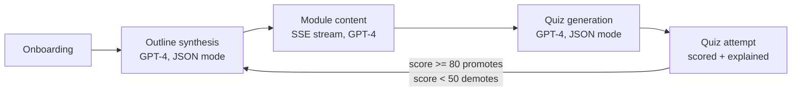
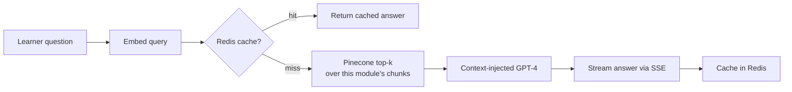
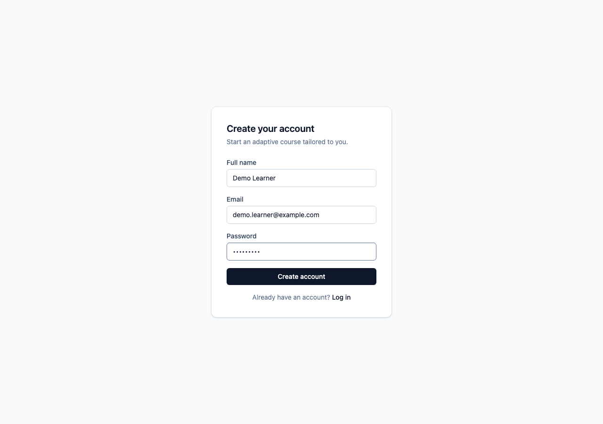
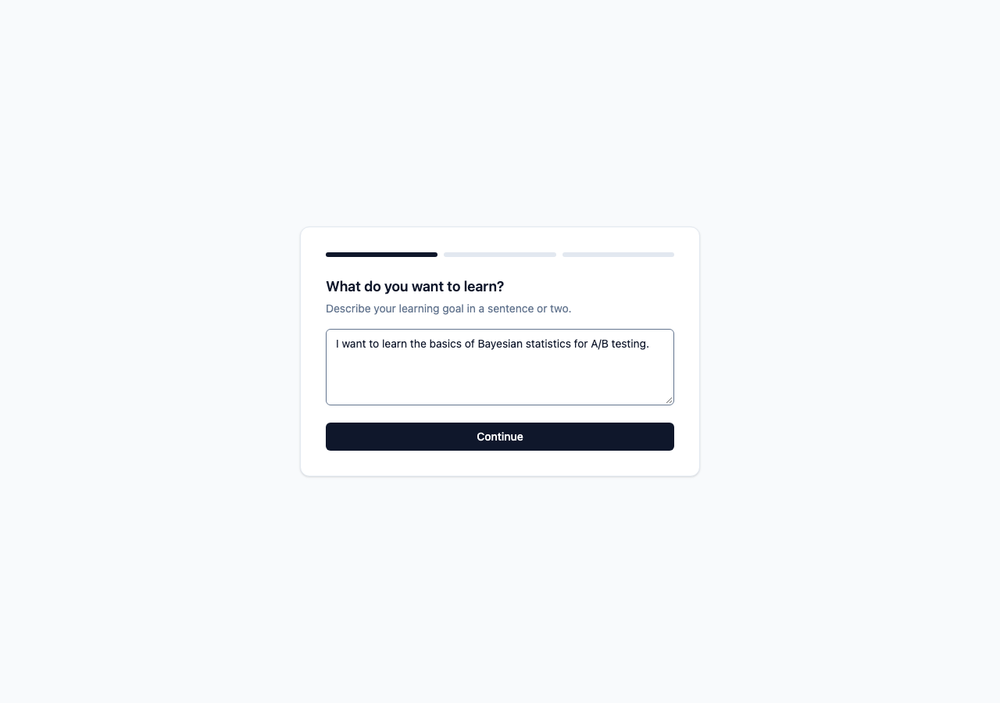
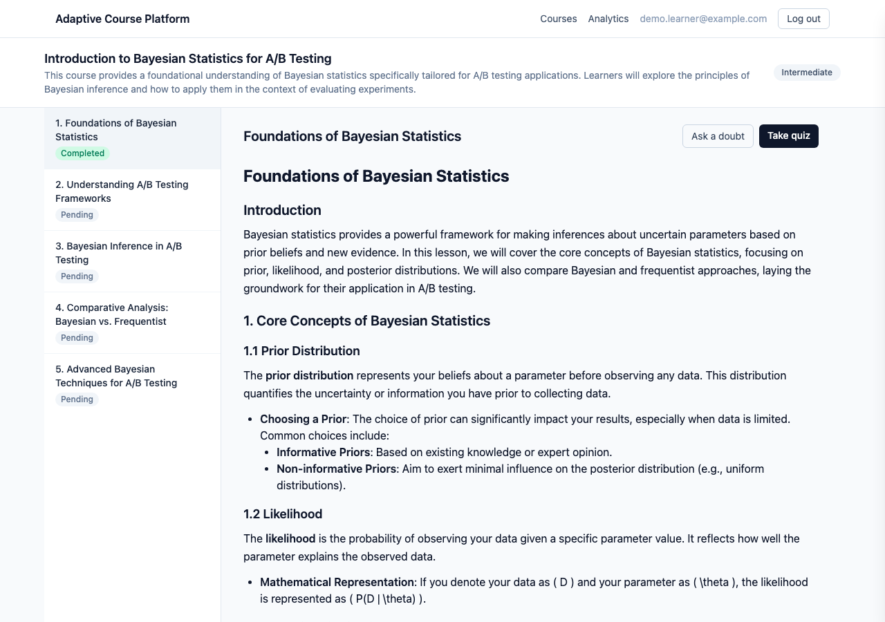
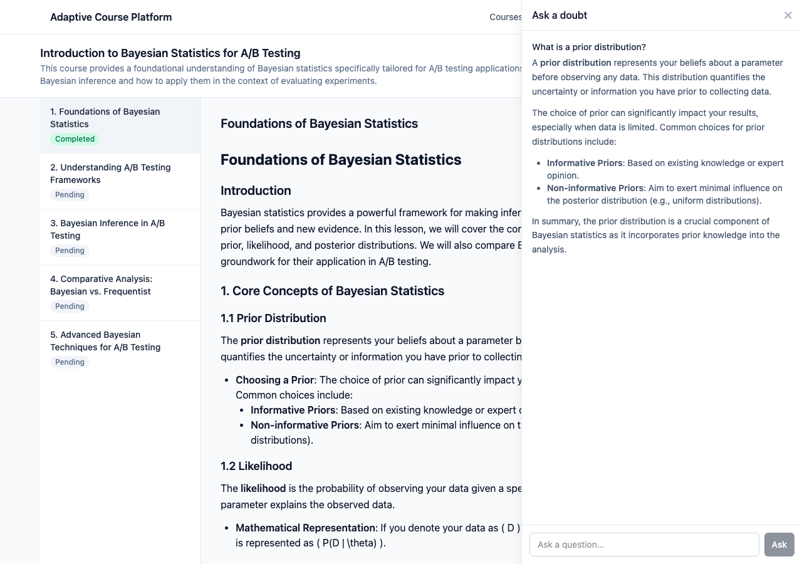
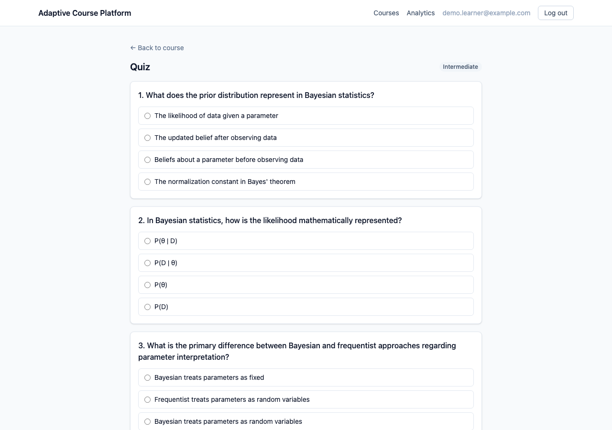
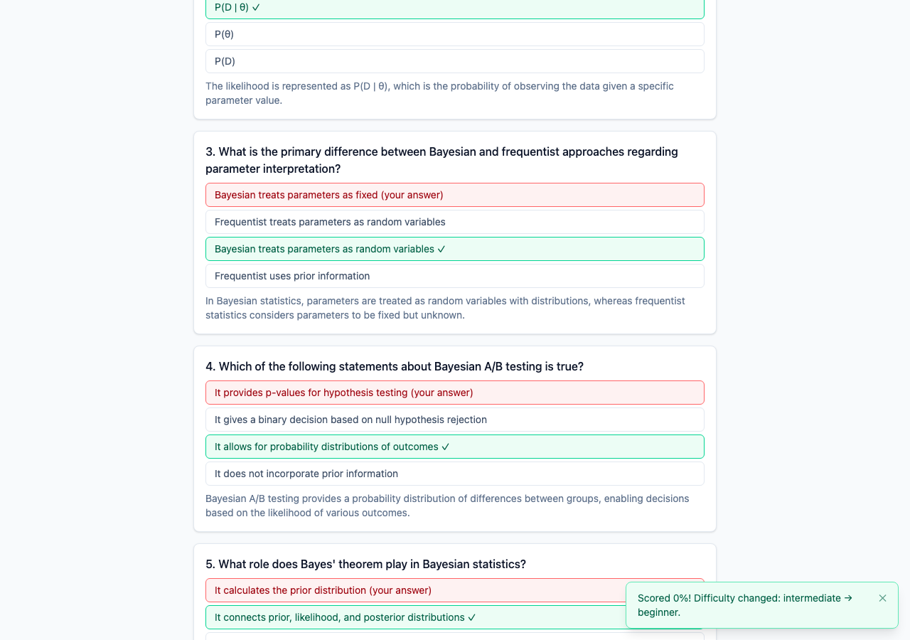
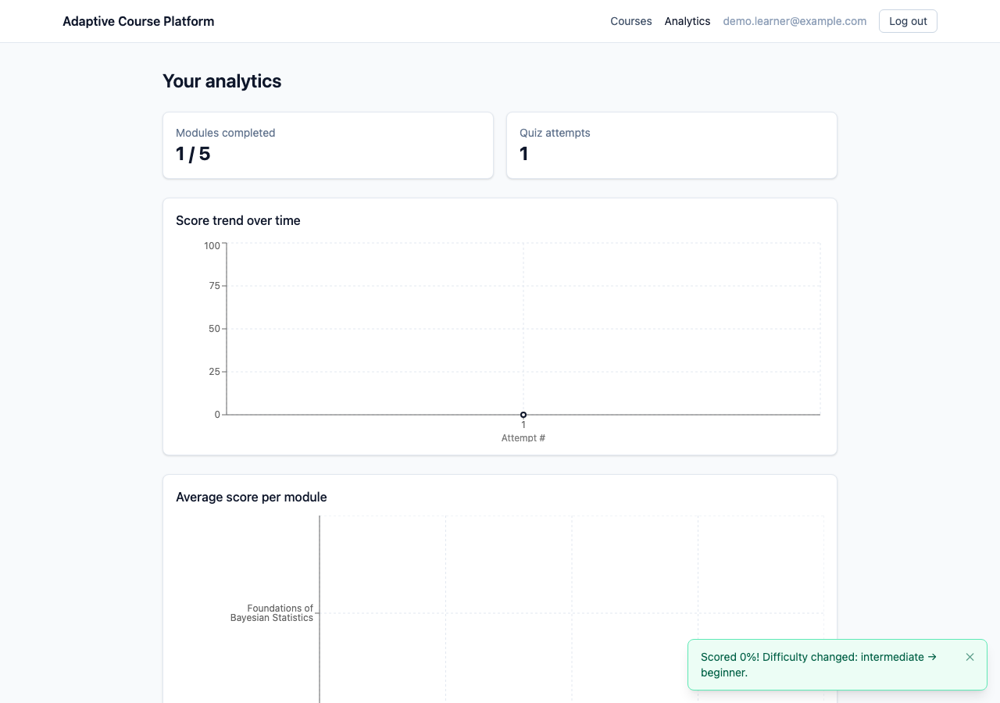

# AI-Powered Adaptive Course Generation Platform

An adaptive learning platform: describe what you want to learn, get a GPT-4-generated
course outline, read lessons as they're generated live, ask questions answered with
RAG over the lesson content, take generated quizzes, and have the course's difficulty
recalibrate itself based on how you score.

## How it works



Doubt resolution runs a small RAG pipeline over each module's own content:



## Stack

- **Backend**: FastAPI (Python 3.11), async SQLAlchemy + asyncpg, Alembic migrations
- **DB**: PostgreSQL 16, Redis 7 (both via Docker Compose)
- **AI**: OpenAI (`gpt-4o-mini` for chat/JSON generation, `text-embedding-3-small` for embeddings), Pinecone (cosine, dim 1536)
- **Frontend**: React + Vite + TypeScript + Tailwind v4, Zustand, React Router, Axios, Recharts
- **Rate limiting**: slowapi, backed by Redis so limits hold across multiple worker processes

## Project structure

```
backend/    FastAPI app — app/{models,schemas,routers,services}, alembic/, tests/
frontend/   React app — src/{pages,components,store,lib,types}
docs/       Screenshots referenced below
```

## Setup

### Prerequisites

- Docker (for Postgres + Redis)
- Python 3.11
- Node 18+
- An OpenAI API key and a Pinecone API key + index (dim `1536`, metric `cosine`)

### 1. Environment

```bash
cp .env.example .env
```

Fill in `OPENAI_API_KEY`, `PINECONE_API_KEY`, `PINECONE_INDEX_NAME`, and generate a real
`JWT_SECRET_KEY` (e.g. `openssl rand -hex 32`). Leave the Postgres/Redis values as-is
unless you've changed the Compose file.

### 2. Databases

```bash
docker compose up -d
```

### 3. Backend

```bash
cd backend
python -m venv venv && source venv/bin/activate
pip install -r requirements.txt
alembic upgrade head
uvicorn app.main:app --reload
```

The API is now at `http://localhost:8000` (docs at `/docs`).

### 4. Frontend

```bash
cd frontend
cp .env.example .env   # VITE_API_URL defaults to http://localhost:8000
npm install
npm run dev
```

Open `http://localhost:5173`.

## Testing

```bash
cd backend
pytest -x
```

Coverage includes the quiz scoring and difficulty-recalibration logic specifically
(`tests/test_quiz_service.py` — pure unit tests for `score_attempt`/`recalibrate_difficulty`,
including threshold edges and unanswered questions) plus an end-to-end attempt flow
(`tests/test_quiz_attempt_endpoint.py`) that verifies a passing attempt promotes
difficulty, a failing one demotes it, and both persist correctly — alongside the
existing RAG pipeline and doubt-resolution tests.

## Rate limiting

The four endpoints that call OpenAI are rate-limited via `slowapi`, keyed by the
authenticated user (falling back to IP for unauthenticated requests) and backed by
Redis so the limits are shared across multiple worker processes:

| Endpoint | Limit |
|---|---|
| `POST /courses` (outline synthesis) | 5/minute |
| `GET /modules/{id}/stream` (content generation) | 10/minute |
| `POST /modules/{id}/quiz` (quiz generation) | 10/minute |
| `POST /doubts` (RAG Q&A) | 15/minute |

A request over the limit gets a `429` with `{"error": "Rate limit exceeded: ..."}`,
which the frontend surfaces as a toast rather than a page-level error.

## Production deployment

### Backend (Docker, any host)

```bash
cd backend
docker build -t course-platform-backend .
docker run --env-file .env -p 8000:8000 course-platform-backend
```

The image runs `alembic upgrade head` before starting `uvicorn`. Configuration comes
entirely from real process environment variables (not a baked-in `.env` file), so pass
them with `--env-file` / a compose `environment:` block. It respects `$PORT` (falls
back to `8000`) and `$WEB_CONCURRENCY` (worker count, default `2`) for platforms that
assign these dynamically.

### Deploying to Railway (backend) + Vercel (frontend)

This is a step-by-step walkthrough for the specific combination this project is set up
for. Nothing here asks you to paste a secret into a chat — every credential is set
directly in the Railway or Vercel dashboard.

#### 1. Railway: create the project and databases

1. Go to [railway.app](https://railway.app), sign in with GitHub, and authorize it to
   access this repository.
2. **New Project → Deploy from GitHub repo** → select this repo. Railway creates one
   service pointed at the repo root — you'll repoint it at `backend/` next.
3. On that service, open **Settings → Source** and set **Root Directory** to `backend`.
   Railway will detect `backend/Dockerfile` and `backend/railway.json` (already in this
   repo) and use those for the build and healthcheck — you shouldn't need to touch
   build settings manually.
4. In the project canvas, click **+ New → Database → Add PostgreSQL**.
5. Click **+ New → Database → Add Redis**.

#### 2. Railway: configure the backend service's environment variables

Open the backend service → **Variables** tab and add each of these. For `DATABASE_URL`
and `REDIS_URL`, use Railway's variable reference picker (type `${{` and it will
autocomplete the other services' variables) instead of copy-pasting values — that way
they stay in sync if the database ever moves.

| Variable | Value |
|---|---|
| `DATABASE_URL` | reference → `${{Postgres.DATABASE_URL}}` |
| `REDIS_URL` | reference → `${{Redis.REDIS_URL}}` |
| `JWT_SECRET_KEY` | a real secret you generate yourself (e.g. run `openssl rand -hex 32` in your own terminal and paste **the output** here — not into this chat) |
| `OPENAI_API_KEY` | your OpenAI key, set directly in this dashboard |
| `PINECONE_API_KEY` | your Pinecone key, set directly in this dashboard |
| `PINECONE_INDEX_NAME` | your Pinecone index name |
| `CORS_ORIGINS` | placeholder for now, e.g. `https://placeholder.vercel.app` — you'll update this in step 4 once the real Vercel URL exists |

Notes:
- `DATABASE_URL` from Railway's Postgres plugin comes as a plain `postgresql://` URL;
  `app/config.py` now normalizes that to the `postgresql+asyncpg://` driver URL this
  app needs, so the reference just works without editing it.
- `PINECONE_ENVIRONMENT` isn't used by the pinecone-client version this app pins — you
  can leave it unset.
- Don't set `PORT` — Railway injects it automatically and the Dockerfile already reads it.
- Everything else (`JWT_ALGORITHM`, `OPENAI_CHAT_MODEL`, `WEB_CONCURRENCY`, etc.) has a
  sane default; only add it if you want to override it.

Railway will redeploy automatically once the required variables are in place. Watch the
**Deployments** tab for the build/deploy logs — you should see the Alembic migration
output followed by `Uvicorn running on http://0.0.0.0:$PORT`.

#### 3. Railway: get a public URL for the backend

Open **Settings → Networking** and click **Generate Domain** if one wasn't created
automatically. Copy the resulting `https://<something>.up.railway.app` URL — you'll
need it for the frontend and to test the API (e.g. `curl https://<that-url>/health`).

#### 4. Vercel: deploy the frontend

1. Go to [vercel.com](https://vercel.com), sign in with GitHub, and authorize access to
   this repository.
2. **Add New → Project**, import this repo.
3. In the import screen, click **Edit** next to **Root Directory** and set it to
   `frontend`. Vercel should auto-detect the **Vite** framework preset (build command
   `npm run build`, output directory `dist`) — leave those as detected.
4. Expand **Environment Variables** and add:
   - `VITE_API_URL` = the Railway URL from step 3 (no trailing slash), e.g.
     `https://your-service.up.railway.app`
5. Click **Deploy**.
6. Once it's live, copy the production URL Vercel gives you (`https://your-project.vercel.app`).

`vercel.json` in the frontend already adds the SPA rewrite Vercel needs so that
client-side routes like `/dashboard` or `/courses/12` don't 404 on a hard refresh —
no action needed there.

#### 5. Close the loop: point the backend's CORS at the real frontend URL

Back in Railway → backend service → **Variables**, update `CORS_ORIGINS` to the exact
Vercel URL from step 4 (comma-separate more than one, e.g. if you later add a custom
domain):

```
CORS_ORIGINS=https://your-project.vercel.app
```

Save it — Railway redeploys the backend automatically. Once that finishes, open the
Vercel URL and run through the flow (register → onboarding → a course) to confirm the
frontend can actually reach the backend.

If you also want Vercel's per-branch preview deployments to work against this backend,
add their origins to `CORS_ORIGINS` too (comma-separated) as you create them — preview
URLs aren't known ahead of time, so there's no single wildcard to set once and forget.

## Screenshots

**Onboarding wizard** — a 3-step flow (goal → experience level → pace) that kicks off
real outline generation:




**Course view** — module sidebar with status badges, and lesson content rendered live
as it streams in from GPT-4:



**Doubt panel** — a RAG-backed Q&A drawer, streamed and rendered as markdown:



**Quiz** — generated MCQs, then scored results with per-question explanations and a
toast surfacing any difficulty change:




**Analytics dashboard** — score trend and per-module averages:


