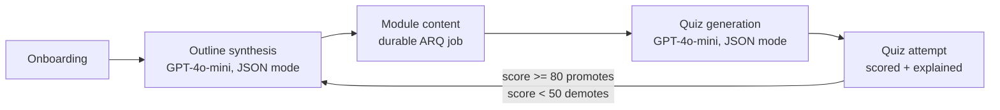
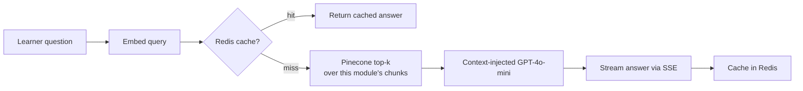
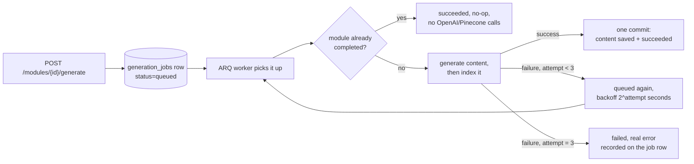

# AI-Powered Adaptive Course Generation Platform

An adaptive course platform: GPT-4o-mini generates lesson content, Pinecone-backed RAG
answers questions about it, and quiz results recalibrate difficulty in a closed loop.
The interesting part isn't the demo, it's making generation survive a crash, measuring
retrieval quality instead of assuming it, and accounting for every LLM call in dollars
and milliseconds.

## Running this

No live demo is deployed right now. Deployment steps (Render + Vercel) are under
["Production deployment"](#production-deployment) below. To run it locally:

```bash
cp .env.example .env   # fill in OPENAI_API_KEY, PINECONE_API_KEY, PINECONE_INDEX_NAME, JWT_SECRET_KEY
docker compose up -d   # Postgres, Redis, and the ARQ worker

cd backend
python -m venv venv && source venv/bin/activate
pip install -r requirements.txt
alembic upgrade head
uvicorn app.main:app --reload

cd ../frontend
cp .env.example .env
npm install
npm run dev
```

Full prerequisites and what each step does are under ["Setup"](#setup) below.

[](https://github.com/riyagmehta/AI-Powered-Adaptive-Course-Generation-Platform/actions/workflows/ci.yml)


## Engineering notes

Concrete problems that came up building this, and how they were actually fixed:

- **SSE cancellation left modules stuck mid-generation.** Module content used to
  stream over the request connection (`GET /modules/{id}/stream`). A client
  disconnect raised `asyncio.CancelledError`, which `except Exception` doesn't
  catch (it's a `BaseException`), leaving the module at `status="generating"`
  forever. Fixed at the time with a shielded rollback
  (`anyio.CancelScope(shield=True)`); the same failure mode is why generation
  later moved off the request path entirely into a durable job queue.

- **Pinecone serverless doesn't support metadata-filtered deletes.** Regenerating
  a module's content means clearing its old vectors first, but serverless indexes
  only support `delete(delete_all=True)` scoped to a namespace, not
  `delete(filter={...})` by metadata (pod-based indexes only). So every module
  gets its own Pinecone namespace (`module-{id}`): "replace this module's
  vectors" becomes "clear this namespace, then upsert."

- **`FastAPI BackgroundTasks` had no persistence.** Content generation started as
  an in-process `BackgroundTask`. If the API process restarted or crashed
  mid-generation, the task vanished with no retry and nothing for the frontend to
  poll. Replaced with ARQ (Redis-backed): jobs are rows in Postgres
  (`generation_jobs`), survive a restart, retry with backoff, and are queryable
  via `GET /modules/{id}/status`.

- **A 409 race between two things that both assumed they owned generation.**
  Course creation kicked off the first module's generation in the background at
  the same moment the frontend's content reader made its own request to start
  it. Whichever won set `status="generating"` first, and the loser hit a `409`
  with no real handling. Fixed by making the job queue the only place generation
  gets triggered, so there's no second code path left to race.

- **Native `EventSource` couldn't carry auth or a POST body.** Streaming doubt
  answers over SSE looked like a fit for the browser's built-in `EventSource`,
  until it turned out `EventSource` can't set an `Authorization` header (this API
  is JWT-only) or send a POST body (needed for the question). Built a small
  `fetch`-based SSE reader (`frontend/src/lib/sse.ts`) instead.

- **A cache hit that quietly still did the work wouldn't fail a simple
  assertion.** The doubt-answer Redis cache needed to prove it skips the Pinecone
  query and chat completion on a hit, not just serve a cached string while
  re-running retrieval underneath. The test wraps `query_module_context` in an
  `AsyncMock(wraps=...)` spy and asserts its call count stays flat across a cache
  hit, so a regression that reintroduces the redundant call fails a test instead
  of just looking fine in the response.

## Measured results

**Retrieval quality.** Full methodology is under ["RAG evaluation"](#rag-evaluation)
below: a real 6-module course, 25 question/expected-passage pairs, run against the
actual chunking/embedding/retrieval code, not a mocked stand-in.

Worth stating plainly: at the original chunk size (1,500 chars), each module produced
almost exactly 4 chunks, so `top_k=5` retrieved the entire module every time.
recall@3 and recall@5 read as a perfect 1.00, which sounds good and measures nothing,
since there was nowhere for the right chunk to get lost.

| Metric | Baseline (1,500-char chunks) | After (800-char chunks) |
|---|---|---|
| Chunks/module (mean) | 4.0 | 7.7 |
| recall@1 | 0.76 | 0.76 |
| recall@3 | 1.00 | 0.96 |
| recall@5 | 1.00 | 1.00 |
| MRR | 0.867 | 0.848 |
| Groundedness (LLM-judged) | 1.00 | 1.00 |
| Refusal rate (5 out-of-scope questions) | 1.00 | 1.00 |

A more aggressive first attempt (500-char chunks, `top_k` dropped to 3-4) made things
worse: recall@1 fell to 0.64, groundedness to 0.88. That result is kept in the full
writeup rather than dropped, because it showed the regression was partly the eval
finally being hard enough to expose real ranking limits, and that the groundedness
drop traced to context volume, not chunk size.

**Caveat, stated plainly:** 25 questions over one generated course is a smoke test,
not a statistically powered benchmark. Good enough to catch "this metric measures
nothing," not evidence of a generally correct chunk size for other content.

**Cost and latency.** `GET /admin/metrics` aggregates per-call instrumentation
(`app/services/llm_metrics.py`) logging every chat/embedding call's tokens, USD cost,
and latency. Real numbers from one test course, a quiz, and a few doubts:

- Generating one ~5,000-character module's content: 142 prompt tokens, 846
  completion tokens, **$0.00053**, 7.0s.
- Embedding that module for indexing: 850 tokens, **$0.000017**, 0.9s.
- Route latency (p50 / p95, small sample): `POST /courses` 2.7s, `POST
  /modules/{id}/quiz` 4.5s, `GET /admin/metrics` 42ms / 69ms, `GET /health` 1.2ms.

These are from a handful of real requests during development, not production
traffic. The point isn't the specific numbers, it's that they exist and are
queryable by user, course, and endpoint instead of being an assumption nobody
checked.

## How it works



Doubt resolution runs a small RAG pipeline over each module's own content:



### Module content generation: a durable job, not a request

Generating a module's content and indexing it for RAG calls enough external services
(OpenAI, then Pinecone) that tying it to one HTTP connection isn't reliable: a
dropped connection or a redeployed pod shouldn't lose the work. So it runs as an
[ARQ](https://arq-docs.helpmanual.io/) (Redis-backed, async-native) job in a separate
worker process instead:



The frontend polls `GET /modules/{id}/status` instead of guessing when the content
will be ready. Three properties worth calling out (see `backend/app/worker.py` and
`backend/tests/test_generation_worker.py`):

- **Idempotent**: the task checks whether the module is already `"completed"` before
  doing any work, so a duplicate delivery or a post-crash requeue of an already-done
  job is a no-op with no repeat OpenAI/Pinecone calls.
- **No partial state**: `module.content` and `module.status = "completed"` are only
  written in one commit at the very end, after both the OpenAI call and the Pinecone
  indexing have fully succeeded in memory. An interruption before that leaves the
  module's persisted state untouched, never half a lesson.
- **Crash recovery**: if a worker is killed mid-job, its row is left stuck in
  `"running"`. On startup, every worker scans for jobs stuck in `"running"` and
  requeues them.

## Stack

- **Backend**: FastAPI (Python 3.11), async SQLAlchemy + asyncpg, Alembic migrations
- **Jobs**: ARQ (Redis-backed) for durable, retryable module-generation jobs, run by a
  separate worker process
- **DB**: PostgreSQL 16, Redis 7 (both via Docker Compose)
- **AI**: OpenAI (`gpt-4o-mini` for chat/JSON generation, `text-embedding-3-small` for embeddings), Pinecone (cosine, dim 1536)
- **Frontend**: React + Vite + TypeScript + Tailwind v4, Zustand, React Router, Axios, Recharts
- **Rate limiting**: slowapi, backed by Redis so limits hold across multiple worker processes
- **Observability**: structlog (JSON logs, request-ID tracing across the ARQ boundary),
  per-LLM-call cost/latency tracking, an admin metrics endpoint
- **CI**: GitHub Actions, backend tests against real Postgres/Redis service containers,
  frontend typecheck + build

## Project structure

```
backend/    FastAPI app: app/{models,schemas,routers,services}, app/worker.py, alembic/, tests/
            tests/eval/ (RAG evaluation harness, see "RAG evaluation" below)
frontend/   React app: src/{pages,components,store,lib,types}
docs/       Screenshots referenced below
```

## Setup

### Prerequisites

- Docker (for Postgres + Redis)
- Python 3.11
- Node 18+
- An OpenAI API key and a Pinecone API key + index (dim `1536`, metric `cosine`)

### 1. Environment

```bash
cp .env.example .env
```

Fill in `OPENAI_API_KEY`, `PINECONE_API_KEY`, `PINECONE_INDEX_NAME`, and generate a real
`JWT_SECRET_KEY` (e.g. `openssl rand -hex 32`). Leave the Postgres/Redis values as-is
unless you've changed the Compose file.

### 2. Databases + worker

```bash
docker compose up -d
```

Starts Postgres, Redis, and the ARQ worker (`course_platform_worker`), which needs
migrations applied before it has anything to do (next step). If you bring it up
before then, it crash-loops (`restart: unless-stopped`) until the `generation_jobs`
table exists, then recovers on its own.

### 3. Backend

```bash
cd backend
python -m venv venv && source venv/bin/activate
pip install -r requirements.txt
alembic upgrade head
uvicorn app.main:app --reload
```

The API is now at `http://localhost:8000` (docs at `/docs`). Course creation and
`POST /modules/{id}/generate` enqueue jobs that the Compose worker picks up;
`docker logs -f course_platform_worker` to watch it work.

### 4. Frontend

```bash
cd frontend
cp .env.example .env   # VITE_API_URL defaults to http://localhost:8000
npm install
npm run dev
```

Open `http://localhost:5173`.

## Testing

```bash
cd backend
pytest -x               # everything except tests marked `live`
pytest -x -m live       # only the tests that need a real, reachable Pinecone index
```

Service modules (`ai_client`, `redis_client`, `pinecone_client`) build their clients
lazily on first use, not at import, so most of the suite runs with no external
credentials at all. Only `tests/test_rag_pipeline.py` and
`tests/test_doubts_endpoint.py` touch a real Pinecone index (OpenAI is always mocked
via `fake_openai`), and both are marked `@pytest.mark.live`.

Coverage includes:
- Quiz scoring and difficulty-recalibration logic (`tests/test_quiz_service.py`),
  including threshold edges and unanswered questions, plus an end-to-end attempt
  flow (`tests/test_quiz_attempt_endpoint.py`) verifying a passing attempt promotes
  difficulty, a failing one demotes it, and both persist correctly.
- The generation job queue (`tests/test_generation_worker.py`), calling the ARQ task
  directly: a job stuck `"running"` when the worker restarts gets requeued and
  completes; a job whose OpenAI call always fails retries twice with backoff and
  lands in `"failed"` with the real error recorded; running the identical job twice
  against an already-`"completed"` module is a no-op the second time. Verified live
  against the real Docker worker too, including a `docker kill -9` mid-job.
- The existing RAG pipeline and doubt-resolution tests.
- Observability (`tests/test_observability.py`, `tests/test_admin_metrics.py`): the
  request-ID middleware generates or echoes one correctly; a non-admin gets a 403
  from `/admin/metrics`, an unauthenticated caller a 401, and an admin sees a real
  LLM call correctly rolled up by user, course, and endpoint.

`pytest` doesn't include the RAG evaluation harness (`tests/eval/`), since it costs
real OpenAI/Pinecone calls and reports quality metrics rather than pass/fail. See
"RAG evaluation" below.

## Continuous integration

`.github/workflows/ci.yml` runs on every push and PR: the backend job spins up real
Postgres and Redis service containers, runs migrations, and runs `pytest -m "not
live"`; the frontend job runs `tsc -b` and `npm run build`. No Pinecone credentials
are configured in CI at all, since the tests that need a live index are excluded
(see "Testing" above) and run locally instead.

## Rate limiting

The four endpoints that call OpenAI are rate-limited via `slowapi`, keyed by the
authenticated user (falling back to IP for unauthenticated requests) and backed by
Redis so the limits are shared across multiple worker processes:

| Endpoint | Limit |
|---|---|
| `POST /courses` (outline synthesis) | 5/minute |
| `POST /modules/{id}/generate` (enqueues content generation) | 10/minute |
| `POST /modules/{id}/quiz` (quiz generation) | 10/minute |
| `POST /doubts` (RAG Q&A) | 15/minute |

A request over the limit gets a `429` with `{"error": "Rate limit exceeded: ..."}`,
which the frontend surfaces as a toast rather than a page-level error.

## Observability

**Structured logging + request tracing.** Every log line (ours, uvicorn's,
sqlalchemy's, httpx's, arq's) is JSON, via structlog's `ProcessorFormatter`
(`app/observability/logging_config.py`). `RequestIDMiddleware` binds a request ID
into structlog's contextvars for the life of each request and returns it in the
response, so it's attached to every log line automatically. That includes across the
async boundary into the ARQ worker: when a request enqueues a generation job, the
request ID rides along as a job argument, so one `request_id` ties together the
HTTP request's log line, the job's log lines, the LLM call it made, and the
underlying `httpx` request to OpenAI:

```json
{"event": "llm_call", "purpose": "content", "endpoint": "POST /courses", "model": "gpt-4o-mini", "prompt_tokens": 142, "completion_tokens": 846, "cost_usd": 0.0005289, "latency_ms": 6965.4, "cache_hit": false, "user_id": 251, "course_id": 245, "module_id": 311, "job_id": 43, "request_id": "536a100458144ae88f4d3befe8e61e4f"}
```

**Per-LLM-call cost tracking.** Every real chat-completion or embedding call
(outline synthesis, module content generation, doubt Q&A including cache hits, quiz
generation, RAG indexing) goes through `app/services/llm_metrics.py` instead of
calling the OpenAI client directly. Each call is logged as JSON and written to an
`llm_calls` table: model, tokens, a computed USD cost (small per-model pricing
table), latency, cache hit/miss, and whichever of user/course/module apply. `GET
/admin/metrics` (admin-only) aggregates it: total cost, cost by user/course/endpoint
(with cache hit rate), a daily time series, and `?days=N` to change the window
(default 30).

**Route latency (p50/p95).** `TimingMiddleware` records every request's duration
into a capped, per-route Redis list (most recent 500 samples), Redis rather than
in-process memory so the numbers stay correct across multiple worker processes.
Reported in the same `/admin/metrics` response.

**Admin access.** `GET /admin/metrics` requires `current_user.is_admin` (403
otherwise). There's no admin UI, so promote a user directly:

```bash
cd backend && source venv/bin/activate
python -c "
import asyncio
from sqlalchemy import select
from app.database import AsyncSessionLocal
from app.models.user import User

async def main():
    async with AsyncSessionLocal() as db:
        user = (await db.execute(select(User).where(User.email == 'you@example.com'))).scalar_one()
        user.is_admin = True
        await db.commit()

asyncio.run(main())
"
```

## RAG evaluation

`tests/eval/` measures retrieval and answer quality against the real
chunking/embedding/retrieval code, using a dedicated Pinecone namespace, not any
live user's data.

**The eval set** (`corpus.json`, `eval_set.json`): a real 6-module course
("Distributed Systems Fundamentals"), generated through the actual outline/content
services, no lorem-ipsum. 25 question/expected-excerpt pairs (GPT-4o-mini drafted,
one prompt per module), where each excerpt is verified as an exact substring of the
module's content, so scoring stays valid across different chunking schemes. 5 more
questions on unrelated topics (baking, sports trivia) test refusal instead of
retrieval.

**What's measured** (`run_eval.py`): `recall@1/3/5` and `MRR`, with retrieval always
fetching top-5 so scores are comparable across configs; mean retrieval latency;
groundedness, an LLM judge checking whether every claim in a generated answer is
actually supported by the retrieved context; and refusal rate on the 5 out-of-scope
questions.

Full before/after numbers, and the write-up of a first attempt that made things
worse before landing on the current config, are in ["Measured
results"](#measured-results) above.

**Reproducing this:**

```bash
cd backend
python -m tests.eval.run_eval --name {baseline,experiment} --chunk-size N --chunk-overlap N --answer-top-k N
```

Per-question results land in `tests/eval/results/*.json`. Regenerating the corpus or
eval set (`generate_corpus.py`, `generate_eval_set.py`) costs real OpenAI calls and
isn't required to re-run the eval.

## Production deployment

### Backend (Docker, any host)

The same image serves two roles, the API and the ARQ worker, selected by the
container's start command:

```bash
cd backend
docker build -t course-platform-backend .

# API: runs migrations, then serves HTTP
docker run --env-file .env -p 8000:8000 course-platform-backend

# Worker: processes module-generation jobs, no HTTP server, no migrations
docker run --env-file .env course-platform-backend \
  arq app.worker.WorkerSettings --custom-log-dict app.worker.ARQ_LOG_CONFIG
```

`--custom-log-dict` stops the `arq` CLI's own logging setup from attaching a second,
plain-text handler that would otherwise double-print every worker log line. Run the
API's migration step from one instance only; the worker command never touches
migrations, so it's safe to run several worker replicas. Configuration comes
entirely from real process environment variables (`--env-file` / a compose
`environment:` block), and the API respects `$PORT` and `$WEB_CONCURRENCY` for
platforms that assign these dynamically.

### Deploying to Render (backend) + Vercel (frontend)

The backend — API, ARQ worker, Postgres, and Redis — is defined as a single
[Render Blueprint](https://render.com/docs/infrastructure-as-code) in `render.yaml`
at the repo root, targeting Render's free tier throughout. Every credential below is
entered directly in the Render or Vercel dashboard, never pasted into a chat.

> **Free tier means slow first requests.** Render's free web services and workers
> spin down after 15 minutes with no traffic. The next request wakes the container
> back up, which takes roughly **30-60 seconds** before it responds — expect that
> delay on the first hit after any idle period, not just after a deploy. Free
> Postgres also expires 30 days after creation (14-day grace period to upgrade or
> export before data is deleted), and the free Redis/Key Value instance is capped at
> 25MB and doesn't persist data across restarts — both fine for a demo, not for
> anything you need to keep.

1. **Render, sync the Blueprint:** Dashboard → **New → Blueprint**, pick this GitHub
   repo. Render reads `render.yaml` and proposes three services: the
   `course-platform-api` web service and `course-platform-worker` background worker
   (both built from `backend/Dockerfile` via the blueprint's `rootDir: backend`), a
   free `course-platform-postgres` database, and a free `course-platform-redis`
   Key Value instance. `DATABASE_URL` and `REDIS_URL` are wired automatically on both
   services via the blueprint's `fromDatabase`/`fromService` references.
2. **Secrets:** the blueprint declares `JWT_SECRET_KEY`, `OPENAI_API_KEY`,
   `PINECONE_API_KEY`, and `PINECONE_INDEX_NAME` as `sync: false` on both services, so
   Render prompts for each during the sync — paste real values (generate
   `JWT_SECRET_KEY` yourself). `CORS_ORIGINS` is also `sync: false` on the API
   service; leave it as a placeholder for now, you'll set it for real in step 4.
   `PINECONE_ENVIRONMENT` isn't used by this app. Don't set `PORT`; Render injects it,
   and `app/config.py` already normalizes Render's plain `postgres://` connection
   string to the asyncpg driver the same way it does for other providers.
3. **Public URL:** after the sync finishes, the API service's dashboard page shows
   its `onrender.com` URL under **Settings**.
4. **Vercel:** import this repo, set **Root Directory** to `frontend` (Vite preset
   auto-detects), add `VITE_API_URL` = the Render URL from step 3, deploy.
5. **Close the loop:** back on Render, set the API service's `CORS_ORIGINS` env var to
   the real Vercel URL from step 4 (comma-separated if you add more later, e.g. a
   custom domain or preview deployments) — this triggers a redeploy of the API
   service only, the worker is untouched.

`WEB_CONCURRENCY` is pinned to `1` in `render.yaml` for the API service: free web
services get 512MB RAM / 0.1 CPU, and a second uvicorn worker process (each with its
own OpenAI/Pinecone clients) risks OOM at that ceiling. Migrations still run on every
API deploy — `backend/Dockerfile`'s `CMD` runs `alembic upgrade head` before starting
uvicorn, and Render always runs the image's `CMD`/start command fresh on deploy, so
there's no separate release-phase step to configure. The worker service overrides
that same image's command (via the blueprint's `dockerCommand`) to run `arq` instead,
and never runs migrations itself — safe to scale to multiple worker instances later
without racing migrations against each other.

`vercel.json` already adds the SPA rewrite Vercel needs so client-side routes like
`/dashboard` don't 404 on a hard refresh.

## Screenshots

**Onboarding wizard**, a 3-step flow (goal, experience level, pace) that kicks off
real outline generation:


**Course view**: module sidebar with status badges tracking each module's generation
job, lesson content rendered once the background job finishes:


**Doubt panel**: a RAG-backed Q&A drawer, streamed and rendered as markdown:


**Quiz**: generated MCQs, then scored results with per-question explanations and a
toast surfacing any difficulty change:


**Analytics dashboard**: score trend and per-module averages:


