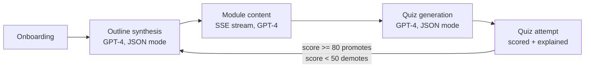
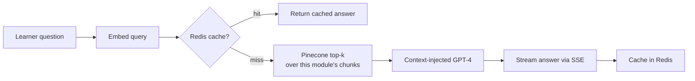

# AI-Powered Adaptive Course Generation Platform

An adaptive learning platform: describe what you want to learn, get a GPT-4-generated
course outline, read lessons as they're generated live, ask questions answered with
RAG over the lesson content, take generated quizzes, and have the course's difficulty
recalibrate itself based on how you score.

## How it works



Doubt resolution runs a small RAG pipeline over each module's own content:



## Stack

- **Backend**: FastAPI (Python 3.11), async SQLAlchemy + asyncpg, Alembic migrations
- **DB**: PostgreSQL 16, Redis 7 (both via Docker Compose)
- **AI**: OpenAI (`gpt-4o-mini` for chat/JSON generation, `text-embedding-3-small` for embeddings), Pinecone (cosine, dim 1536)
- **Frontend**: React + Vite + TypeScript + Tailwind v4, Zustand, React Router, Axios, Recharts
- **Rate limiting**: slowapi, backed by Redis so limits hold across multiple worker processes

## Project structure

```
backend/    FastAPI app — app/{models,schemas,routers,services}, alembic/, tests/
frontend/   React app — src/{pages,components,store,lib,types}
docs/       Screenshots referenced below
```

## Setup

### Prerequisites

- Docker (for Postgres + Redis)
- Python 3.11
- Node 18+
- An OpenAI API key and a Pinecone API key + index (dim `1536`, metric `cosine`)

### 1. Environment

```bash
cp .env.example .env
```

Fill in `OPENAI_API_KEY`, `PINECONE_API_KEY`, `PINECONE_INDEX_NAME`, and generate a real
`JWT_SECRET_KEY` (e.g. `openssl rand -hex 32`). Leave the Postgres/Redis values as-is
unless you've changed the Compose file.

### 2. Databases

```bash
docker compose up -d
```

### 3. Backend

```bash
cd backend
python -m venv venv && source venv/bin/activate
pip install -r requirements.txt
alembic upgrade head
uvicorn app.main:app --reload
```

The API is now at `http://localhost:8000` (docs at `/docs`).

### 4. Frontend

```bash
cd frontend
cp .env.example .env   # VITE_API_URL defaults to http://localhost:8000
npm install
npm run dev
```

Open `http://localhost:5173`.

## Testing

```bash
cd backend
pytest -x
```

Coverage includes the quiz scoring and difficulty-recalibration logic specifically
(`tests/test_quiz_service.py` — pure unit tests for `score_attempt`/`recalibrate_difficulty`,
including threshold edges and unanswered questions) plus an end-to-end attempt flow
(`tests/test_quiz_attempt_endpoint.py`) that verifies a passing attempt promotes
difficulty, a failing one demotes it, and both persist correctly — alongside the
existing RAG pipeline and doubt-resolution tests.

## Rate limiting

The four endpoints that call OpenAI are rate-limited via `slowapi`, keyed by the
authenticated user (falling back to IP for unauthenticated requests) and backed by
Redis so the limits are shared across multiple worker processes:

| Endpoint | Limit |
|---|---|
| `POST /courses` (outline synthesis) | 5/minute |
| `GET /modules/{id}/stream` (content generation) | 10/minute |
| `POST /modules/{id}/quiz` (quiz generation) | 10/minute |
| `POST /doubts` (RAG Q&A) | 15/minute |

A request over the limit gets a `429` with `{"error": "Rate limit exceeded: ..."}`,
which the frontend surfaces as a toast rather than a page-level error.

## Production deployment

### Backend (Docker)

```bash
cd backend
docker build -t course-platform-backend .
docker run --env-file .env -p 8000:8000 course-platform-backend
```

The image runs `alembic upgrade head` before starting `uvicorn` with 4 workers.
Configuration comes entirely from real process environment variables (not a baked-in
`.env` file), so pass them with `--env-file` / a compose `environment:` block and point
`DATABASE_URL`/`REDIS_URL` at your production Postgres and Redis instances.

### Frontend

```bash
cd frontend
npm run build
```

Serve the resulting `dist/` from any static host (Vercel, Netlify, nginx, etc.), with
`VITE_API_URL` set at build time to your deployed backend's URL.

## Screenshots

**Onboarding wizard** — a 3-step flow (goal → experience level → pace) that kicks off
real outline generation:


**Course view** — module sidebar with status badges, and lesson content rendered live
as it streams in from GPT-4:


**Doubt panel** — a RAG-backed Q&A drawer, streamed and rendered as markdown:


**Quiz** — generated MCQs, then scored results with per-question explanations and a
toast surfacing any difficulty change:


**Analytics dashboard** — score trend and per-module averages:


