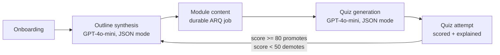
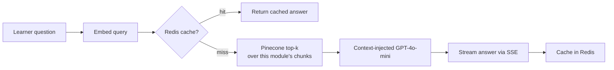

# AI-Powered Adaptive Course Generation Platform

An adaptive course platform: GPT-4o-mini generates lesson content, Pinecone-backed RAG
answers questions about it, and quiz results recalibrate difficulty in a closed loop.
The engineering interest is less the demo and more what it took to make generation
survive a crash, retrieval quality get measured instead of assumed, and every LLM
call get accounted for in dollars and milliseconds.

## Running this

No live demo is deployed right now — deployment steps (Railway + Vercel) are under
["Production deployment"](#production-deployment) below. To run it locally:

```bash
cp .env.example .env   # fill in OPENAI_API_KEY, PINECONE_API_KEY, PINECONE_INDEX_NAME, JWT_SECRET_KEY
docker compose up -d   # Postgres, Redis, and the ARQ worker

cd backend
python -m venv venv && source venv/bin/activate
pip install -r requirements.txt
alembic upgrade head
uvicorn app.main:app --reload

cd ../frontend
cp .env.example .env
npm install
npm run dev
```

Full prerequisites and what each step does are under ["Setup"](#setup) below.

[](https://github.com/riyagmehta/AI-Powered-Adaptive-Course-Generation-Platform/actions/workflows/ci.yml)


## Engineering notes

Concrete problems that came up building this, and what actually fixed them —
not a feature list.

- **SSE cancellation left modules stuck mid-generation.** Module content used to
  stream directly over the request connection (`GET /modules/{id}/stream`). If the
  client disconnected mid-stream, the coroutine received `asyncio.CancelledError` —
  which `except Exception` doesn't catch, since `CancelledError` is a `BaseException`
  in modern Python. The module was left at `status="generating"` forever, with
  nothing to ever revisit it. Fixed at the time with a shielded rollback
  (`anyio.CancelScope(shield=True)` to flip the status back before re-raising, even
  though the enclosing scope was already cancelled) — and the same failure mode
  (an interruption nothing revisits) is exactly why generation later moved off the
  request path into a durable job queue instead of getting patched again.

- **Pinecone serverless doesn't support metadata-filtered deletes.** Regenerating a
  module's content means the old vectors need to go first. Serverless Pinecone
  indexes only support `delete(delete_all=True)` scoped to a namespace — not
  `delete(filter={...})` by metadata, which is pod-based-index-only. So every module
  gets its own Pinecone namespace (`module-{id}`): "replace this module's vectors"
  becomes "clear this one namespace, then upsert," which serverless does support.

- **`FastAPI BackgroundTasks` looked sufficient until a restart proved otherwise.**
  Content generation started as an in-process `BackgroundTask` fired from
  `POST /courses`. It has no persistence: if the API process restarted or crashed
  mid-generation, the task and any trace it ever ran were just gone — no retry, no
  status the frontend could poll, nothing to distinguish "still working" from
  "silently died." Replaced with ARQ (Redis-backed): jobs are rows in Postgres
  (`generation_jobs`), survive a process restart, retry with exponential backoff, and
  are queryable via `GET /modules/{id}/status` instead of guessed at.

- **A 409 race between two things that both assumed they owned generation.** Course
  creation kicked off the first module's generation in the background at the same
  moment the frontend's content reader made its own request to start streaming it —
  whichever won set `status="generating"` first, and the loser's request hit a `409`
  the UI had no real handling for. Patched short-term with a client-side polling
  fallback on 409; actually closed by making the job queue the one place generation
  gets triggered and `GET /modules/{id}/status` the one thing polled, so there's no
  second code path left to race it.

- **Native `EventSource` couldn't do either thing this API needed.** Streaming doubt
  answers over SSE looked like a natural fit for the browser's built-in
  `EventSource` — until it turned out `EventSource` can't set an `Authorization`
  header (this API is JWT-only) and can't send a POST body (needed for the question
  text). Built a small `fetch`-based SSE reader (`frontend/src/lib/sse.ts`) that
  parses the same `text/event-stream` wire format by hand instead, used for the
  doubt stream and, while it existed, the module content stream.

- **A cache hit that quietly still did the work wouldn't fail on a return-value
  check alone.** The doubt-answer Redis cache needed to prove it was actually
  skipping the expensive parts (the Pinecone query and the chat completion) on a
  hit, not just serving a cached string while re-running the retrieval underneath
  anyway. The test wraps `query_module_context` in an `AsyncMock(wraps=...)` spy and
  asserts its call count — and the chat-completion mock's — stay flat across a cache
  hit, so a regression that silently reintroduced the redundant call fails a test
  instead of just looking fine in the response.

## Measured results

### Retrieval quality

Full methodology, the eval set, and reproduction steps are under
["RAG evaluation"](#rag-evaluation) below — the short version: a real 6-module
course, 25 question → expected-passage pairs, run against the actual
chunking/embedding/retrieval code, not a mocked stand-in.

The number worth being upfront about: at the original chunk size (1,500 chars),
each module produced almost exactly 4 chunks, so querying `top_k=5` retrieved *the
entire module* every time. recall@3 and recall@5 read as a perfect 1.00 — which
sounds good and measures nothing, since there was nowhere for the right chunk to
get lost.

| Metric | Baseline (1,500-char chunks) | After (800-char chunks) |
|---|---|---|
| Chunks/module (mean) | 4.0 | 7.7 |
| recall@1 | 0.76 | 0.76 |
| recall@3 | 1.00 | 0.96 |
| recall@5 | 1.00 | 1.00 |
| MRR | 0.867 | 0.848 |
| Groundedness (LLM-judged) | 1.00 | 1.00 |
| Refusal rate (5 out-of-scope questions) | 1.00 | 1.00 |

A more aggressive first attempt (500-char chunks, answer context `top_k` dropped to
3–4) actually made things worse — recall@1 fell to 0.64, groundedness to 0.88 —
before landing on 800 chars with `top_k` left at 5. That failed attempt is written
up in full below rather than left out, because it's the more informative of the two
results: it's what showed the "regression" was partly the eval finally being hard
enough to expose real ranking limits, and that the groundedness drop traced to
context volume, not chunk size itself.

**Caveat, stated plainly**: 25 questions over one generated course is a smoke test,
not a statistically powered benchmark. It's good enough to catch "this metric
measures nothing" and confirm a fix didn't regress anything on the same eval set —
it is not evidence of a generally-correct chunk size for other content.

### Cost and latency

`GET /admin/metrics` aggregates per-call instrumentation (`app/services/llm_metrics.py`)
that logs every chat/embedding call's tokens, computed USD cost, and latency.
Real numbers from a single test course plus one quiz and a few doubts:

- Generating one ~5,000-character module's content: 142 prompt tokens, 846
  completion tokens, **$0.00053**, 7.0s.
- Embedding that module for indexing: 850 tokens, **$0.000017**, 0.9s.
- Route latency (p50 / p95, small sample): `POST /courses` 2.7s (a real GPT-4o-mini
  outline call) · `POST /modules/{id}/quiz` 4.5s · `GET /admin/metrics` 42ms / 69ms ·
  `GET /health` 1.2ms.

These are from a handful of real requests made during development, not production
traffic — the point isn't the specific numbers, it's that the numbers exist and are
queryable at all, broken down by user/course/endpoint, instead of "a GPT-4o-mini
call costs about X" being an assumption nobody checked.

## How it works



Doubt resolution runs a small RAG pipeline over each module's own content:



### Module content generation: a durable job, not a request

Generating a module's content and indexing it for RAG can take long enough, and calls
enough external services (OpenAI, then Pinecone), that tying it to a single HTTP
request/connection isn't reliable — a dropped connection or a redeployed API pod
shouldn't lose the work. So it runs as an [ARQ](https://arq-docs.helpmanual.io/)
(Redis-backed, async-native) job in a separate worker process instead:


The frontend polls `GET /modules/{id}/status` instead of guessing when the content
will be ready. A few properties worth calling out, since they're the actual point of
this design (see `backend/app/worker.py` and `backend/tests/test_generation_worker.py`):

- **Idempotent**: the task checks whether the module is already `"completed"` before
  doing any work. A duplicate delivery of the same job, or a job requeued after a
  crash that actually finished, is a no-op — no repeat OpenAI/Pinecone calls.
- **No partial state**: `module.content` and `module.status = "completed"` are only
  written in the single commit at the very end, after both the OpenAI call and the
  Pinecone indexing have fully succeeded in memory. An interruption at any point
  before that leaves the module's persisted state exactly as it was — never half a
  lesson.
- **Crash recovery**: if a worker process is killed mid-job, its row is left stuck in
  `"running"` (nothing else would ever revisit it otherwise). On startup, every worker
  scans for jobs stuck in `"running"` and requeues them.

## Stack

- **Backend**: FastAPI (Python 3.11), async SQLAlchemy + asyncpg, Alembic migrations
- **Jobs**: ARQ (Redis-backed) for durable, retryable module-generation jobs, run by a
  separate worker process
- **DB**: PostgreSQL 16, Redis 7 (both via Docker Compose)
- **AI**: OpenAI (`gpt-4o-mini` for chat/JSON generation, `text-embedding-3-small` for embeddings), Pinecone (cosine, dim 1536)
- **Frontend**: React + Vite + TypeScript + Tailwind v4, Zustand, React Router, Axios, Recharts
- **Rate limiting**: slowapi, backed by Redis so limits hold across multiple worker processes
- **Observability**: structlog (JSON logs, request-ID tracing across the ARQ boundary),
  per-LLM-call cost/latency tracking, an admin metrics endpoint
- **CI**: GitHub Actions — backend tests against real Postgres/Redis service containers,
  frontend typecheck + build

## Project structure

```
backend/    FastAPI app — app/{models,schemas,routers,services}, app/worker.py, alembic/, tests/
            tests/eval/ — RAG evaluation harness (see "RAG evaluation" below)
frontend/   React app — src/{pages,components,store,lib,types}
docs/       Screenshots referenced below
```

## Setup

### Prerequisites

- Docker (for Postgres + Redis)
- Python 3.11
- Node 18+
- An OpenAI API key and a Pinecone API key + index (dim `1536`, metric `cosine`)

### 1. Environment

```bash
cp .env.example .env
```

Fill in `OPENAI_API_KEY`, `PINECONE_API_KEY`, `PINECONE_INDEX_NAME`, and generate a real
`JWT_SECRET_KEY` (e.g. `openssl rand -hex 32`). Leave the Postgres/Redis values as-is
unless you've changed the Compose file.

### 2. Databases + worker

```bash
docker compose up -d
```

This starts Postgres, Redis, and the ARQ worker (`course_platform_worker`) that
processes module-generation jobs. The worker connects to Postgres/Redis over the
Compose network, so it needs migrations applied before it has anything to do — that
happens in the next step. If you bring it up before then, it'll just crash-loop
(`restart: unless-stopped`) until the `generation_jobs` table exists, then recover on
its own.

### 3. Backend

```bash
cd backend
python -m venv venv && source venv/bin/activate
pip install -r requirements.txt
alembic upgrade head
uvicorn app.main:app --reload
```

The API is now at `http://localhost:8000` (docs at `/docs`). Course creation and
`POST /modules/{id}/generate` enqueue jobs that the Compose worker picks up —
`docker logs -f course_platform_worker` to watch it work.

### 4. Frontend

```bash
cd frontend
cp .env.example .env   # VITE_API_URL defaults to http://localhost:8000
npm install
npm run dev
```

Open `http://localhost:5173`.

## Testing

```bash
cd backend
pytest -x               # everything except tests marked `live`
pytest -x -m live       # only the tests that need a real, reachable Pinecone index
```

Importing any service module (`ai_client`, `redis_client`, `pinecone_client`) never
requires credentials or makes a network call by itself — each lazily constructs and
caches its client (`get_openai_client()`, `get_redis_client()`, an internal
`_get_index()`) on first actual use instead of at module import time. That's what
makes it possible to run most of the suite with no external credentials at all: only
the handful of tests that actually call Pinecone are marked `@pytest.mark.live`
(`tests/test_rag_pipeline.py`, `tests/test_doubts_endpoint.py` — the OpenAI side of
both is still mocked via `fake_openai`) and excluded from the default run.

Coverage includes:
- Quiz scoring and difficulty-recalibration logic (`tests/test_quiz_service.py` — pure
  unit tests for `score_attempt`/`recalibrate_difficulty`, including threshold edges and
  unanswered questions) plus an end-to-end attempt flow (`tests/test_quiz_attempt_endpoint.py`)
  that verifies a passing attempt promotes difficulty, a failing one demotes it, and
  both persist correctly.
- The generation job queue (`tests/test_generation_worker.py`), calling the ARQ task
  function directly: a job that's already `"running"` when the worker restarts gets
  requeued by `on_startup` and then actually completes; a job whose OpenAI call always
  fails retries twice with the expected backoff and lands in `"failed"` with the real
  error recorded on its third attempt; and running the identical job twice against an
  already-`"completed"` module is a no-op the second time (no repeat OpenAI/Pinecone
  calls). These same three scenarios were also verified live against the real Docker
  worker, Postgres, Redis, OpenAI, and Pinecone — including actually `docker kill -9`-ing
  the worker mid-job and watching it recover on restart.
- The existing RAG pipeline and doubt-resolution tests.
- Observability (`tests/test_observability.py`, `tests/test_admin_metrics.py`): the
  request-ID middleware generates one when absent and echoes back an inbound one
  unchanged; a non-admin gets a 403 from `/admin/metrics`, an unauthenticated caller
  gets a 401, and an admin sees a real (fake_openai-mocked) LLM call correctly rolled
  up by user, course, and endpoint.

`pytest` doesn't include the RAG evaluation harness (`tests/eval/`) — it costs real
OpenAI/Pinecone calls and reports quality metrics rather than pass/fail, so it's a
separate script; see "RAG evaluation" below.

## Continuous integration

`.github/workflows/ci.yml` runs on every push and PR: the backend job spins up real
Postgres and Redis service containers, runs migrations, and runs `pytest -m "not
live"`; the frontend job runs `tsc -b` and `npm run build`.

No Pinecone credentials are configured in CI at all, and none are needed — the two
test files that query a real Pinecone index are marked `live` and excluded from
CI's run (see "Testing" above). They're still run locally, against a real index,
before anything ships.

## Rate limiting

The four endpoints that call OpenAI are rate-limited via `slowapi`, keyed by the
authenticated user (falling back to IP for unauthenticated requests) and backed by
Redis so the limits are shared across multiple worker processes:

| Endpoint | Limit |
|---|---|
| `POST /courses` (outline synthesis) | 5/minute |
| `POST /modules/{id}/generate` (enqueues content generation) | 10/minute |
| `POST /modules/{id}/quiz` (quiz generation) | 10/minute |
| `POST /doubts` (RAG Q&A) | 15/minute |

A request over the limit gets a `429` with `{"error": "Rate limit exceeded: ..."}`,
which the frontend surfaces as a toast rather than a page-level error.

## Observability

### Structured logging + request tracing

Every log line — ours, uvicorn's, sqlalchemy's, httpx's, arq's — is JSON
(`app/observability/logging_config.py`, stdlib `logging` routed through
structlog's `ProcessorFormatter`). `RequestIDMiddleware` binds a request ID
into structlog's contextvars for the life of each request (reusing an inbound
`X-Request-ID` header if present, otherwise minting one, and always returning
it in the response), so it's automatically attached to every log line emitted
while handling that request — no need to pass it around manually.

That includes across the async boundary into the ARQ worker: when
`POST /courses` or `POST /modules/{id}/generate` enqueues a generation job, the
request ID (and the triggering endpoint) rides along as job arguments, and
`generate_module_content_task` binds them for its own duration. The result —
verified live, not just in theory — is that one `request_id` ties together the
original HTTP request's log line, the job's log lines, the LLM call it made,
and even the underlying `httpx` request log to OpenAI:

```json
{"event": "llm_call", "purpose": "content", "endpoint": "POST /courses", "model": "gpt-4o-mini", "prompt_tokens": 142, "completion_tokens": 846, "cost_usd": 0.0005289, "latency_ms": 6965.4, "cache_hit": false, "user_id": 251, "course_id": 245, "module_id": 311, "job_id": 43, "request_id": "536a100458144ae88f4d3befe8e61e4f"}
```

### Per-LLM-call cost tracking

Every real chat-completion or embedding call — outline synthesis, module
content generation, doubt Q&A (including a separate zero-cost row for cache
hits, so hit rate stays visible), quiz generation, and RAG indexing — goes
through `app/services/llm_metrics.py` rather than calling the OpenAI client
directly. Each call is logged as structured JSON *and* written to an
`llm_calls` table: model, prompt/completion tokens, a computed USD cost (from
a small per-model pricing table — update it if OpenAI's pricing changes),
latency, cache hit/miss, and whichever of user/course/module apply.

`GET /admin/metrics` (admin-only — see below) aggregates it: total cost, cost
by user, by course, by endpoint (with cache hit rate), a daily time series,
and `?days=N` to change the window (default 30).

### Route latency (p50/p95)

`TimingMiddleware` records every request's duration into a capped, per-route
Redis list (`latency:{method}:{route}`, most recent 500 samples) — Redis
rather than in-process memory so the numbers stay correct with multiple
worker processes or replicas. `GET /admin/metrics` reads these back and
reports p50/p95 per route alongside the cost breakdown.

### Admin access

`GET /admin/metrics` requires `current_user.is_admin` (403 otherwise) — there's
no admin UI, so promote a user directly:

```bash
cd backend && source venv/bin/activate
python -c "
import asyncio
from sqlalchemy import select
from app.database import AsyncSessionLocal
from app.models.user import User

async def main():
    async with AsyncSessionLocal() as db:
        user = (await db.execute(select(User).where(User.email == 'you@example.com'))).scalar_one()
        user.is_admin = True
        await db.commit()

asyncio.run(main())
"
```

## RAG evaluation

RAG quality was being assumed, not measured — `tests/eval/` is a harness that
actually measures it, using the real chunking/embedding/retrieval code paths
against a dedicated Pinecone namespace (not any live user's data).

**The eval set** (`tests/eval/corpus.json`, `eval_set.json`): a real 6-module course
("Distributed Systems Fundamentals") generated end-to-end through the actual
outline + content services — no lorem-ipsum. 25 question → expected-excerpt pairs
were then generated per module (GPT-4o-mini, one prompt per module, asking for
questions answerable from one localized passage), where the "expected excerpt" is a
10–30 word span verified to be an exact substring of that module's content. Scoring
a retrieval by "does this substring appear in a retrieved chunk's text" — rather
than by chunk *index* — is what makes the same eval set valid across different
chunking schemes, which matters since the whole point of this exercise was to
change the chunking scheme. 5 more questions on topics with no relationship to the
course (baking, sports trivia, ...) test refusal instead of retrieval.

**What gets measured** (`tests/eval/run_eval.py`):
- `recall@1/3/5` and `MRR` — retrieval always fetches top-5 (so these are
  comparable across configs), scored by whether the expected excerpt is found in
  the top-*k* results.
- Mean retrieval latency (embed the query + query Pinecone).
- Groundedness rate — for each in-scope question, generate an answer from the
  retrieved chunks (the same prompt shape `doubt_service` uses), then have
  GPT-4o-mini judge, with a strict rubric, whether *every* claim in the answer is
  actually supported by the retrieved context.
- Refusal rate — same judge-based approach, but for the 5 out-of-scope questions:
  did the assistant admit the material doesn't cover this, instead of answering
  from outside knowledge?

### Baseline: original production config

| Metric | Value |
|---|---|
| Mean chunks/module | 4.0 |
| recall@1 | 0.76 |
| recall@3 | 1.00 |
| recall@5 | 1.00 |
| MRR | 0.867 |
| Mean retrieval latency | 0.555s |
| Groundedness rate | 1.00 |
| Refusal rate | 1.00 |

**The numbers confirm the suspicion, and explain why it's a problem.** At
`chunk_size=1500`, every ~5,000-character module produces almost exactly 4 chunks —
confirmed here, not assumed. Querying `top_k=5` against 4 candidates always returns
*all* of them, so recall@3 and recall@5 read as a perfect 1.00 no matter how good or
bad the actual embedding-similarity ranking is. That's a ceiling effect, not evidence
of good retrieval — there's nowhere for the right chunk to get lost. recall@1 (0.76)
and MRR (0.867) are the only numbers here actually saying anything about ranking
quality, because they're the only ones where "wrong" is a reachable outcome.

### Experiment: smaller chunks, and why top_k stayed at 5

First attempt — the obvious move — was `chunk_size=500`, `overlap=100`, and dropping
`answer_top_k` to 3–4. That was worse: recall@1 fell to 0.64, recall@5 to 0.80, and
groundedness to 0.88–0.92. Before concluding smaller chunks are bad, the actual
failure mode was checked directly: for one "miss," the expected excerpt *was*
present verbatim in one of the module's (now 13) chunks — it just didn't rank in
the top 5 out of 13 real candidates. At `chunk_size=1500` that same chunk would've
been 1 of only 4 candidates and always returned; at `chunk_size=500` it's genuinely
competing and the embedding similarity ranking isn't perfect. In other words: some
of that "regression" is the eval finally being hard enough to measure something
real. The groundedness drop was a separate, clearer effect of `answer_top_k=3–4`
with smaller chunks: the model was handed less total context per answer than the
baseline effectively gave it (which, at only 4 chunks and `top_k=5`, was *the entire
module* every time) — with a narrower window, it filled small gaps with outside
knowledge on 2–3 of 25 questions.

Retuning to `chunk_size=800`, `overlap=150`, **with `answer_top_k` left at 5**
(the same as baseline) isolated that: same amount of context reaching the model,
just more precisely selected.

| Metric | Baseline (1500/200, top_k=5) | Experiment (800/150, top_k=5) |
|---|---|---|
| Mean chunks/module | 4.0 | 7.7 |
| recall@1 | 0.76 | 0.76 |
| recall@3 | 1.00 | 0.96 |
| recall@5 | 1.00 | 1.00 |
| MRR | 0.867 | 0.848 |
| Mean retrieval latency | 0.555s | 0.414s |
| Groundedness rate | 1.00 | 1.00 |
| Refusal rate | 1.00 | 1.00 |

recall@1, recall@5, groundedness, and refusal are unchanged; recall@3 and MRR moved
by one question out of 25 (within noise at this sample size) — not a meaningful
regression. Retrieval latency, if anything, improved slightly.

**Action taken**: `CHUNK_MAX_CHARS`/`CHUNK_OVERLAP_CHARS` in
`app/services/embedding_service.py` are now `800`/`150` (were `1500`/`200`).
`doubt_retrieval_top_k` in `app/config.py` was deliberately **left at 5** — the
data showed lowering it hurts groundedness for this corpus, so the part of the
original hypothesis that turned out to be wrong wasn't shipped. The real win isn't
a metrics bump (this corpus's modules are short enough that the baseline's
"retrieve everything" behavior was already giving the model full context); it's
that recall@3/recall@5 now measure something real instead of trivially reading
1.00, so future retrieval regressions (e.g. as modules get longer, or if the
embedding model changes) will actually show up here.

**Reproducing this**: `cd backend && python -m tests.eval.run_eval --name
{baseline,experiment} --chunk-size N --chunk-overlap N --answer-top-k N`. Full
per-question results are in `tests/eval/results/*.json`. Regenerating the corpus or
eval set (`generate_corpus.py`, `generate_eval_set.py`) costs real OpenAI calls and
isn't required to re-run the eval — only if you want a fresh course/question set.

## Production deployment

### Backend (Docker, any host)

The same image serves two roles — the API and the ARQ worker — selected by the
container's start command:

```bash
cd backend
docker build -t course-platform-backend .

# API — runs migrations, then serves HTTP
docker run --env-file .env -p 8000:8000 course-platform-backend

# Worker — processes module-generation jobs, no HTTP server, no migrations
docker run --env-file .env course-platform-backend \
  arq app.worker.WorkerSettings --custom-log-dict app.worker.ARQ_LOG_CONFIG
```

The `--custom-log-dict` flag matters: the `arq` CLI unconditionally attaches its own
plain-text log handler on startup, which would otherwise print every worker log line
twice (once as JSON, once as arq's own text format) alongside the structured logging
setup above.

The API's default command runs `alembic upgrade head` before starting `uvicorn` —
run only one instance of that per deploy (or otherwise ensure migrations only apply
once) so multiple API replicas don't race each other on schema changes; the worker
command never touches migrations, so it's safe to run as many worker replicas as you
want. Configuration comes entirely from real process environment variables (not a
baked-in `.env` file), so pass them with `--env-file` / a compose `environment:` block.
The API command respects `$PORT` (falls back to `8000`) and `$WEB_CONCURRENCY`
(worker count, default `2`) for platforms that assign these dynamically.

### Deploying to Railway (backend) + Vercel (frontend)

This is a step-by-step walkthrough for the specific combination this project is set up
for. Nothing here asks you to paste a secret into a chat — every credential is set
directly in the Railway or Vercel dashboard.

#### 1. Railway: create the project and databases

1. Go to [railway.app](https://railway.app), sign in with GitHub, and authorize it to
   access this repository.
2. **New Project → Deploy from GitHub repo** → select this repo. Railway creates one
   service pointed at the repo root — you'll repoint it at `backend/` next.
3. On that service, open **Settings → Source** and set **Root Directory** to `backend`.
   Railway will detect `backend/Dockerfile` and `backend/railway.json` (already in this
   repo) and use those for the build and healthcheck — you shouldn't need to touch
   build settings manually.
4. In the project canvas, click **+ New → Database → Add PostgreSQL**.
5. Click **+ New → Database → Add Redis**.

#### 2. Railway: configure the backend service's environment variables

Open the backend (API) service → **Variables** tab and add each of these. For
`DATABASE_URL` and `REDIS_URL`, use Railway's variable reference picker (type `${{` and
it will autocomplete the other services' variables) instead of copy-pasting values —
that way they stay in sync if the database ever moves.

| Variable | Value |
|---|---|
| `DATABASE_URL` | reference → `${{Postgres.DATABASE_URL}}` |
| `REDIS_URL` | reference → `${{Redis.REDIS_URL}}` |
| `JWT_SECRET_KEY` | a real secret you generate yourself (e.g. run `openssl rand -hex 32` in your own terminal and paste **the output** here — not into this chat) |
| `OPENAI_API_KEY` | your OpenAI key, set directly in this dashboard |
| `PINECONE_API_KEY` | your Pinecone key, set directly in this dashboard |
| `PINECONE_INDEX_NAME` | your Pinecone index name |
| `CORS_ORIGINS` | placeholder for now, e.g. `https://placeholder.vercel.app` — you'll update this in step 5 once the real Vercel URL exists |

Notes:
- `DATABASE_URL` from Railway's Postgres plugin comes as a plain `postgresql://` URL;
  `app/config.py` now normalizes that to the `postgresql+asyncpg://` driver URL this
  app needs, so the reference just works without editing it.
- `PINECONE_ENVIRONMENT` isn't used by the pinecone-client version this app pins — you
  can leave it unset.
- Don't set `PORT` — Railway injects it automatically and the Dockerfile already reads it.
- Everything else (`JWT_ALGORITHM`, `OPENAI_CHAT_MODEL`, `WEB_CONCURRENCY`, etc.) has a
  sane default; only add it if you want to override it.

Railway will redeploy automatically once the required variables are in place. Watch the
**Deployments** tab for the build/deploy logs — you should see the Alembic migration
output followed by `Uvicorn running on http://0.0.0.0:$PORT`.

#### 3. Railway: add the worker as a second service

Module generation won't actually run without a worker — the API only enqueues jobs.
Add it as its own service in the **same** Railway project (so it shares the Postgres
and Redis you already created), pointed at the same repo but with a different start
command:

1. In the project canvas, **+ New → GitHub Repo** → select this repo again. This
   creates a second, independent service from the same source.
2. **Settings → Source → Root Directory** = `backend` (same as the API service).
3. **Settings → Deploy → Custom Start Command** =
   `arq app.worker.WorkerSettings --custom-log-dict app.worker.ARQ_LOG_CONFIG` —
   this replaces the Dockerfile's default command (which runs migrations + `uvicorn`,
   and isn't what you want here) for this service only. The `--custom-log-dict` flag
   stops `arq`'s own logging setup from double-printing every log line (see
   "Observability" above).
4. **Settings → Deploy → Healthcheck Path** — clear it if `backend/railway.json` has
   populated it with `/health`. The worker doesn't serve HTTP at all, so an HTTP
   healthcheck here will just fail and crash-loop a perfectly healthy worker.
5. **Variables**: add `DATABASE_URL` and `REDIS_URL` as the same `${{Postgres...}}` /
   `${{Redis...}}` references from step 2, plus `OPENAI_API_KEY`, `PINECONE_API_KEY`,
   and `PINECONE_INDEX_NAME` with the same values as the API service. (Railway's
   project-level **Shared Variables** are worth using here instead of retyping these —
   set them once at the project level and reference them from both services.)

Watch this service's **Deployments** log for `Starting worker for 1 functions:
generate_module_content_task` — that confirms it's up and polling Redis.

#### 4. Railway: get a public URL for the backend

Open the **API** service's **Settings → Networking** and click **Generate Domain** if
one wasn't created automatically. Copy the resulting `https://<something>.up.railway.app`
URL — you'll need it for the frontend and to test the API (e.g.
`curl https://<that-url>/health`). The worker service has no public URL and doesn't
need one.

#### 5. Vercel: deploy the frontend

1. Go to [vercel.com](https://vercel.com), sign in with GitHub, and authorize access to
   this repository.
2. **Add New → Project**, import this repo.
3. In the import screen, click **Edit** next to **Root Directory** and set it to
   `frontend`. Vercel should auto-detect the **Vite** framework preset (build command
   `npm run build`, output directory `dist`) — leave those as detected.
4. Expand **Environment Variables** and add:
   - `VITE_API_URL` = the Railway URL from step 4 (no trailing slash), e.g.
     `https://your-service.up.railway.app`
5. Click **Deploy**.
6. Once it's live, copy the production URL Vercel gives you (`https://your-project.vercel.app`).

`vercel.json` in the frontend already adds the SPA rewrite Vercel needs so that
client-side routes like `/dashboard` or `/courses/12` don't 404 on a hard refresh —
no action needed there.

#### 6. Close the loop: point the backend's CORS at the real frontend URL

Back in Railway → **API** service → **Variables**, update `CORS_ORIGINS` to the exact
Vercel URL from step 5 (comma-separate more than one, e.g. if you later add a custom
domain):

```
CORS_ORIGINS=https://your-project.vercel.app
```

Save it — Railway redeploys the backend automatically. Once that finishes, open the
Vercel URL and run through the flow (register → onboarding → a course) to confirm the
frontend can actually reach the backend.

If you also want Vercel's per-branch preview deployments to work against this backend,
add their origins to `CORS_ORIGINS` too (comma-separated) as you create them — preview
URLs aren't known ahead of time, so there's no single wildcard to set once and forget.

## Screenshots

**Onboarding wizard** — a 3-step flow (goal → experience level → pace) that kicks off
real outline generation:


**Course view** — module sidebar with status badges tracking each module's generation
job, and lesson content rendered once the background job finishes:


**Doubt panel** — a RAG-backed Q&A drawer, streamed and rendered as markdown:


**Quiz** — generated MCQs, then scored results with per-question explanations and a
toast surfacing any difficulty change:


**Analytics dashboard** — score trend and per-module averages:


