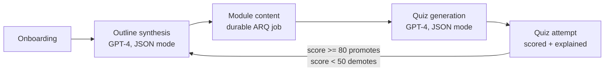
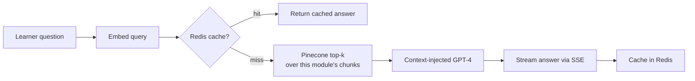

# AI-Powered Adaptive Course Generation Platform

An adaptive learning platform: describe what you want to learn, get a GPT-4-generated
course outline, watch lessons finish generating in the background, ask questions
answered with RAG over the lesson content, take generated quizzes, and have the
course's difficulty recalibrate itself based on how you score.

## How it works



Doubt resolution runs a small RAG pipeline over each module's own content:



### Module content generation: a durable job, not a request

Generating a module's content and indexing it for RAG can take long enough, and calls
enough external services (OpenAI, then Pinecone), that tying it to a single HTTP
request/connection isn't reliable — a dropped connection or a redeployed API pod
shouldn't lose the work. So it runs as an [ARQ](https://arq-docs.helpmanual.io/)
(Redis-backed, async-native) job in a separate worker process instead:


The frontend polls `GET /modules/{id}/status` instead of guessing when the content
will be ready. A few properties worth calling out, since they're the actual point of
this design (see `backend/app/worker.py` and `backend/tests/test_generation_worker.py`):

- **Idempotent**: the task checks whether the module is already `"completed"` before
  doing any work. A duplicate delivery of the same job, or a job requeued after a
  crash that actually finished, is a no-op — no repeat OpenAI/Pinecone calls.
- **No partial state**: `module.content` and `module.status = "completed"` are only
  written in the single commit at the very end, after both the OpenAI call and the
  Pinecone indexing have fully succeeded in memory. An interruption at any point
  before that leaves the module's persisted state exactly as it was — never half a
  lesson.
- **Crash recovery**: if a worker process is killed mid-job, its row is left stuck in
  `"running"` (nothing else would ever revisit it otherwise). On startup, every worker
  scans for jobs stuck in `"running"` and requeues them.

## Stack

- **Backend**: FastAPI (Python 3.11), async SQLAlchemy + asyncpg, Alembic migrations
- **Jobs**: ARQ (Redis-backed) for durable, retryable module-generation jobs, run by a
  separate worker process
- **DB**: PostgreSQL 16, Redis 7 (both via Docker Compose)
- **AI**: OpenAI (`gpt-4o-mini` for chat/JSON generation, `text-embedding-3-small` for embeddings), Pinecone (cosine, dim 1536)
- **Frontend**: React + Vite + TypeScript + Tailwind v4, Zustand, React Router, Axios, Recharts
- **Rate limiting**: slowapi, backed by Redis so limits hold across multiple worker processes

## Project structure

```
backend/    FastAPI app — app/{models,schemas,routers,services}, app/worker.py, alembic/, tests/
frontend/   React app — src/{pages,components,store,lib,types}
docs/       Screenshots referenced below
```

## Setup

### Prerequisites

- Docker (for Postgres + Redis)
- Python 3.11
- Node 18+
- An OpenAI API key and a Pinecone API key + index (dim `1536`, metric `cosine`)

### 1. Environment

```bash
cp .env.example .env
```

Fill in `OPENAI_API_KEY`, `PINECONE_API_KEY`, `PINECONE_INDEX_NAME`, and generate a real
`JWT_SECRET_KEY` (e.g. `openssl rand -hex 32`). Leave the Postgres/Redis values as-is
unless you've changed the Compose file.

### 2. Databases + worker

```bash
docker compose up -d
```

This starts Postgres, Redis, and the ARQ worker (`course_platform_worker`) that
processes module-generation jobs. The worker connects to Postgres/Redis over the
Compose network, so it needs migrations applied before it has anything to do — that
happens in the next step. If you bring it up before then, it'll just crash-loop
(`restart: unless-stopped`) until the `generation_jobs` table exists, then recover on
its own.

### 3. Backend

```bash
cd backend
python -m venv venv && source venv/bin/activate
pip install -r requirements.txt
alembic upgrade head
uvicorn app.main:app --reload
```

The API is now at `http://localhost:8000` (docs at `/docs`). Course creation and
`POST /modules/{id}/generate` enqueue jobs that the Compose worker picks up —
`docker logs -f course_platform_worker` to watch it work.

### 4. Frontend

```bash
cd frontend
cp .env.example .env   # VITE_API_URL defaults to http://localhost:8000
npm install
npm run dev
```

Open `http://localhost:5173`.

## Testing

```bash
cd backend
pytest -x
```

Coverage includes:
- Quiz scoring and difficulty-recalibration logic (`tests/test_quiz_service.py` — pure
  unit tests for `score_attempt`/`recalibrate_difficulty`, including threshold edges and
  unanswered questions) plus an end-to-end attempt flow (`tests/test_quiz_attempt_endpoint.py`)
  that verifies a passing attempt promotes difficulty, a failing one demotes it, and
  both persist correctly.
- The generation job queue (`tests/test_generation_worker.py`), calling the ARQ task
  function directly: a job that's already `"running"` when the worker restarts gets
  requeued by `on_startup` and then actually completes; a job whose OpenAI call always
  fails retries twice with the expected backoff and lands in `"failed"` with the real
  error recorded on its third attempt; and running the identical job twice against an
  already-`"completed"` module is a no-op the second time (no repeat OpenAI/Pinecone
  calls). These same three scenarios were also verified live against the real Docker
  worker, Postgres, Redis, OpenAI, and Pinecone — including actually `docker kill -9`-ing
  the worker mid-job and watching it recover on restart.
- The existing RAG pipeline and doubt-resolution tests.

## Rate limiting

The four endpoints that call OpenAI are rate-limited via `slowapi`, keyed by the
authenticated user (falling back to IP for unauthenticated requests) and backed by
Redis so the limits are shared across multiple worker processes:

| Endpoint | Limit |
|---|---|
| `POST /courses` (outline synthesis) | 5/minute |
| `POST /modules/{id}/generate` (enqueues content generation) | 10/minute |
| `POST /modules/{id}/quiz` (quiz generation) | 10/minute |
| `POST /doubts` (RAG Q&A) | 15/minute |

A request over the limit gets a `429` with `{"error": "Rate limit exceeded: ..."}`,
which the frontend surfaces as a toast rather than a page-level error.

## Production deployment

### Backend (Docker, any host)

The same image serves two roles — the API and the ARQ worker — selected by the
container's start command:

```bash
cd backend
docker build -t course-platform-backend .

# API — runs migrations, then serves HTTP
docker run --env-file .env -p 8000:8000 course-platform-backend

# Worker — processes module-generation jobs, no HTTP server, no migrations
docker run --env-file .env course-platform-backend arq app.worker.WorkerSettings
```

The API's default command runs `alembic upgrade head` before starting `uvicorn` —
run only one instance of that per deploy (or otherwise ensure migrations only apply
once) so multiple API replicas don't race each other on schema changes; the worker
command never touches migrations, so it's safe to run as many worker replicas as you
want. Configuration comes entirely from real process environment variables (not a
baked-in `.env` file), so pass them with `--env-file` / a compose `environment:` block.
The API command respects `$PORT` (falls back to `8000`) and `$WEB_CONCURRENCY`
(worker count, default `2`) for platforms that assign these dynamically.

### Deploying to Railway (backend) + Vercel (frontend)

This is a step-by-step walkthrough for the specific combination this project is set up
for. Nothing here asks you to paste a secret into a chat — every credential is set
directly in the Railway or Vercel dashboard.

#### 1. Railway: create the project and databases

1. Go to [railway.app](https://railway.app), sign in with GitHub, and authorize it to
   access this repository.
2. **New Project → Deploy from GitHub repo** → select this repo. Railway creates one
   service pointed at the repo root — you'll repoint it at `backend/` next.
3. On that service, open **Settings → Source** and set **Root Directory** to `backend`.
   Railway will detect `backend/Dockerfile` and `backend/railway.json` (already in this
   repo) and use those for the build and healthcheck — you shouldn't need to touch
   build settings manually.
4. In the project canvas, click **+ New → Database → Add PostgreSQL**.
5. Click **+ New → Database → Add Redis**.

#### 2. Railway: configure the backend service's environment variables

Open the backend (API) service → **Variables** tab and add each of these. For
`DATABASE_URL` and `REDIS_URL`, use Railway's variable reference picker (type `${{` and
it will autocomplete the other services' variables) instead of copy-pasting values —
that way they stay in sync if the database ever moves.

| Variable | Value |
|---|---|
| `DATABASE_URL` | reference → `${{Postgres.DATABASE_URL}}` |
| `REDIS_URL` | reference → `${{Redis.REDIS_URL}}` |
| `JWT_SECRET_KEY` | a real secret you generate yourself (e.g. run `openssl rand -hex 32` in your own terminal and paste **the output** here — not into this chat) |
| `OPENAI_API_KEY` | your OpenAI key, set directly in this dashboard |
| `PINECONE_API_KEY` | your Pinecone key, set directly in this dashboard |
| `PINECONE_INDEX_NAME` | your Pinecone index name |
| `CORS_ORIGINS` | placeholder for now, e.g. `https://placeholder.vercel.app` — you'll update this in step 5 once the real Vercel URL exists |

Notes:
- `DATABASE_URL` from Railway's Postgres plugin comes as a plain `postgresql://` URL;
  `app/config.py` now normalizes that to the `postgresql+asyncpg://` driver URL this
  app needs, so the reference just works without editing it.
- `PINECONE_ENVIRONMENT` isn't used by the pinecone-client version this app pins — you
  can leave it unset.
- Don't set `PORT` — Railway injects it automatically and the Dockerfile already reads it.
- Everything else (`JWT_ALGORITHM`, `OPENAI_CHAT_MODEL`, `WEB_CONCURRENCY`, etc.) has a
  sane default; only add it if you want to override it.

Railway will redeploy automatically once the required variables are in place. Watch the
**Deployments** tab for the build/deploy logs — you should see the Alembic migration
output followed by `Uvicorn running on http://0.0.0.0:$PORT`.

#### 3. Railway: add the worker as a second service

Module generation won't actually run without a worker — the API only enqueues jobs.
Add it as its own service in the **same** Railway project (so it shares the Postgres
and Redis you already created), pointed at the same repo but with a different start
command:

1. In the project canvas, **+ New → GitHub Repo** → select this repo again. This
   creates a second, independent service from the same source.
2. **Settings → Source → Root Directory** = `backend` (same as the API service).
3. **Settings → Deploy → Custom Start Command** = `arq app.worker.WorkerSettings` —
   this replaces the Dockerfile's default command (which runs migrations + `uvicorn`,
   and isn't what you want here) for this service only.
4. **Settings → Deploy → Healthcheck Path** — clear it if `backend/railway.json` has
   populated it with `/health`. The worker doesn't serve HTTP at all, so an HTTP
   healthcheck here will just fail and crash-loop a perfectly healthy worker.
5. **Variables**: add `DATABASE_URL` and `REDIS_URL` as the same `${{Postgres...}}` /
   `${{Redis...}}` references from step 2, plus `OPENAI_API_KEY`, `PINECONE_API_KEY`,
   and `PINECONE_INDEX_NAME` with the same values as the API service. (Railway's
   project-level **Shared Variables** are worth using here instead of retyping these —
   set them once at the project level and reference them from both services.)

Watch this service's **Deployments** log for `Starting worker for 1 functions:
generate_module_content_task` — that confirms it's up and polling Redis.

#### 4. Railway: get a public URL for the backend

Open the **API** service's **Settings → Networking** and click **Generate Domain** if
one wasn't created automatically. Copy the resulting `https://<something>.up.railway.app`
URL — you'll need it for the frontend and to test the API (e.g.
`curl https://<that-url>/health`). The worker service has no public URL and doesn't
need one.

#### 5. Vercel: deploy the frontend

1. Go to [vercel.com](https://vercel.com), sign in with GitHub, and authorize access to
   this repository.
2. **Add New → Project**, import this repo.
3. In the import screen, click **Edit** next to **Root Directory** and set it to
   `frontend`. Vercel should auto-detect the **Vite** framework preset (build command
   `npm run build`, output directory `dist`) — leave those as detected.
4. Expand **Environment Variables** and add:
   - `VITE_API_URL` = the Railway URL from step 4 (no trailing slash), e.g.
     `https://your-service.up.railway.app`
5. Click **Deploy**.
6. Once it's live, copy the production URL Vercel gives you (`https://your-project.vercel.app`).

`vercel.json` in the frontend already adds the SPA rewrite Vercel needs so that
client-side routes like `/dashboard` or `/courses/12` don't 404 on a hard refresh —
no action needed there.

#### 6. Close the loop: point the backend's CORS at the real frontend URL

Back in Railway → **API** service → **Variables**, update `CORS_ORIGINS` to the exact
Vercel URL from step 5 (comma-separate more than one, e.g. if you later add a custom
domain):

```
CORS_ORIGINS=https://your-project.vercel.app
```

Save it — Railway redeploys the backend automatically. Once that finishes, open the
Vercel URL and run through the flow (register → onboarding → a course) to confirm the
frontend can actually reach the backend.

If you also want Vercel's per-branch preview deployments to work against this backend,
add their origins to `CORS_ORIGINS` too (comma-separated) as you create them — preview
URLs aren't known ahead of time, so there's no single wildcard to set once and forget.

## Screenshots

**Onboarding wizard** — a 3-step flow (goal → experience level → pace) that kicks off
real outline generation:


**Course view** — module sidebar with status badges tracking each module's generation
job, and lesson content rendered once the background job finishes:


**Doubt panel** — a RAG-backed Q&A drawer, streamed and rendered as markdown:


**Quiz** — generated MCQs, then scored results with per-question explanations and a
toast surfacing any difficulty change:


**Analytics dashboard** — score trend and per-module averages:


